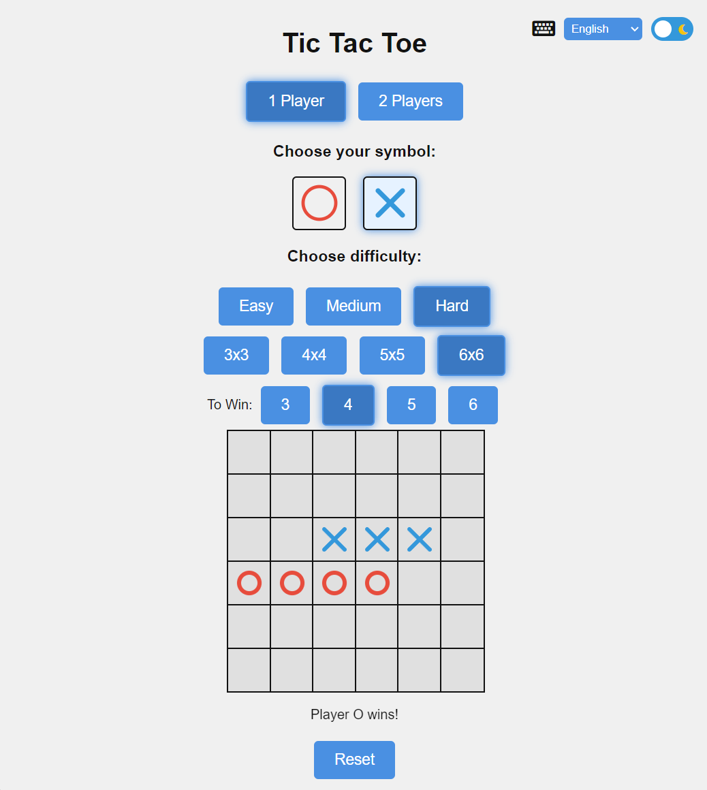
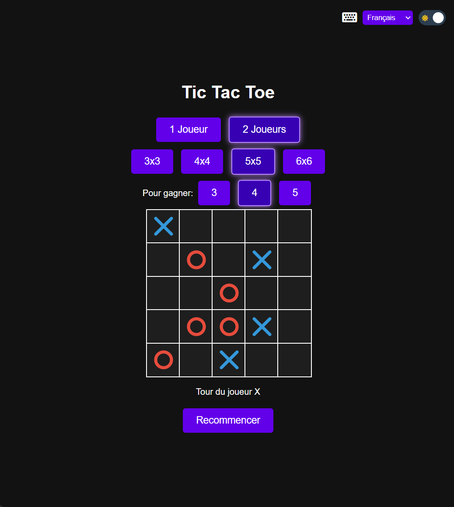

# Tic tac toe
[Test it](https://codingseb.github.io/Tic-tac-toe/)

Coded almost entirely by AI (Claude 3.5 Sonnet, prompted through perplexity.ai)  
Except some minor manual tweaks and customizations

## Features
* Mode 1 or 2 players
* Choose your side
* 3 levels of difficulties in 1 player mode
* Choose the size of the board between 3x3 to 6x6
* Choose the the number of part to align to win
* Multilingual (English, Français, Español, Deutsch, Português, Italiano)
* UI modes Dark/Light mode

## Screenshots

